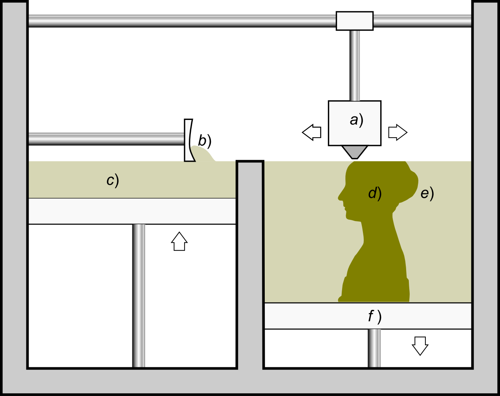

# 3D Printing

* In general 
* ... and with our Prusa i3 MK2

---

## 3D printers 

* Extrusion
* Light polymerized
* Powder Bed
* Laminated

----

### Extrusion

 <!-- .element height="60%" width="60%" -->

----

### Light polymerized

 <!-- .element height="40%" width="40%" -->

----

### Powder Bed

 <!-- .element height="70%" width="70%" -->

----

### Laminated

 <!-- .element height="60%" width="60%" -->

---

## RepRap and big idea behind it

---

## Plastics

----

### ABS

----

### PLA

---

## From Idea to Thing

---

### 3D Modelling
Creating a model from scratch

----

#### 3D Builder
* Simple yet pretty powerful
* Part of Windows 10
* Can import and export _STL_, 3MF and other popular formats
* Can send model directly to a printer (or a 3D printing service)

----

#### Blender
* Free and open source 3D creative suite
* __Modelling__, rigging, animation etc.
* Very powerful, but with steep learning curve
* For 3D printing, best used for modelling and mesh manipulation

----

#### OpenSCAD
* CAD (computer-aided design) tool
* Great for designing very precise models for stuff like machine parts
* Not an interactive modeller - it uses a scripting language to describe the models
* Exports _STL_

---

### Slicing
Making a model printable

----

#### The Idea
* 3D Printers don't understand 3D models
* They require specific instructions on where to move the extruder and how much filament to extrude
* Slicing is the process that takes a 3D model and outputs a _GCode_ that can be printed

----

#### Slic3r
TODO

----

#### Ultimaker Cura
* Originally used for Ultimaker printers
* Has presets for a wide variety of 3D printers, including Prusa
* More intuitive UI compared to Slic3r
* Can set all the main and most of the detailed print options
* For Prusa-specific settings (such as Linear Advance) it's best to use Slic3r and/or PrusaControl

---

### Data formats

----

#### STL
* Origin in "stereolithography"
* Describes only the surface of a 3D object
* No color, no material, no size, no units
* Basically just a set of polygons (also called _mesh_)
* Has ASCII and binary format
----

#### GCode
* AKA a printer program (more exactly it's a numerical control programming language)
* A sequence of machine-readable instructions for the printer
 - Homing, temperature control, calibration
 - Extruder movement, filament extrusion/retraction etc.

---

## Prusa i3 MK2

* Construction
* Firmware 
* Calibration (magic)

----

### Construction
* A combination of metal and plastic parts
* Plastic parts are all 3D printed
 - In accordance with the idea of self-replication
* Metal parts need to be purchased
* Most of the components can be exchanged or modified

----

### Firmware
* The brain of the printer
* Open source (hosted on github)
* Open to pull requests
* Periodic updates
 - Last version: linear advance feature
* Allows for nifty features such as autocalibration and bed skew correction

----

### Calibration
* This is where the magic happens
* You mainly want to get the first layer to stick to the bed
* Experimental process, dependent on many parameters
 - Bed level skew
 - Filament used (not even two PLA filaments are the same)
 - Distance between bed and extruder
 - Extruder and bed temperature etc.

----

### Making it work
* Each print will be different
* Different slicers have different outcomes
* If the first layer doesn't stick, experimentation is required
 - Lower the extruder
 - Increase filament flow
 - Change temperatures etc.
* there is no RIGHT answer here
* Just try it and see - failure is __always__ an option

---

## Next steps with your prints
1. Buy printer
2. Download model
3. ???
4. PROFIT!

----

### When YOU want to print stuff
* Create or find a model
* Pick a filament (PLA/ABS, color)
* Think about how you want to slice it (with supports, with adhesion plate etc.)
* Slice it or ask how to do it
* Be ready to stand watch as the first layer sets
* Keep an eye on the print

----

### Everything will go wrong
* 3D printing is more alchemy than chemistry
* Stuff that can go wrong will go wrong
* Be prepared for bad prints
* Get familiar with settings and options of both slicer and printer
* Experiment - trial and error will get you far

---

## Thank you
